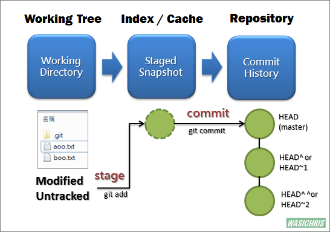

# Git常用操作
Git是目前最流行的版本控制工具，关键还是完全免费的。 大神Linus公司破解了Bitkeeper，被Bitkeeper公司状告。
一怒之下，Linus用不到两周时间就用C语言开发出了Git...只想说：卧槽。。。

1. 创建Git仓库
git init初始化git仓库 -> git add file1,file2将文件添加到暂存区 -> git commit -m "your msg"将文件提交到版本库
-> git push将代码提交到远程仓库

push之前要先关联git仓库，git remote add origin git仓库地址

---

2. 克隆已经仓库： git clone，从github上将已有的库拉取到本地

---

3. 查看状态: git status
   
---

4. 修改的文件在工作区 -> git add 工作区修改的文件后在暂存区 -> git commit后到版本库
Git管理的是“修改”而不是文件内容。这里的修改是指添加一行，删除一行，或改动某一行。

比如当前版本A,增加了一行提交后，就变成了版本B，在版本B把这行删除了，就变成了版本C，不回到版本A 
Git创建分支、合并分支，都使用了C语言中的指针，所以效率很高速度很快



---

5. 文件的比较：
- git diff fileName  比较工作区与暂存区（即上一次add）的对应文件的区别
- git diff --cached fileName 比较暂存区与版本库上文件的区别，把暂存区理解为一个cache即好记忆
- git diff HEAD --fileName 比较工作区与版本库上当前版本（HEAD）的区别
- git diff --staged 比较暂存区与最后一次提交（HEAD）的差异（已暂存的修改）
- git diff commit1 commit2  比较两次提交的差异

---

6. git log
- git log 查看提交历史
- git log --graph可以查看合并分支图
- git reflog 查看记录的每一次命令
- git log --oneline 简洁的查看comitid和提交信息

---

7. Git的时候有可能commit提交代码后，发现这一次commit的内容是有错误的, 就要使用git reset命令。
```
git reset [--hard|soft|mixed|merge|keep] [<commit>或HEAD]：将当前的分支重设(reset)到指定的<commit>或者HEAD(默认，如果不显示指定<commit>，默认是HEAD，即最新的一次提交)
```

常用的有三种模式：soft, mixed, hard：
- git reset --hard 回退到`<commit>`，并且将HEAD指向`<commit>`
- git reset --soft 保留工作目录和暂存区中的内容，并把“重置HEAD所带来的新的差异”放进暂存区。
“重置HEAD所带来的新的差异”即从版本C回退到版本B的两个版本之间的差异。
- git reset --mixed reset 如果不加参数，那么默认使用 --mixed 参数。它的行为是：保留工作目录，并且清空暂存区。也就是说，工作目录的修改、暂存区的内容以及由 reset 所导致的新的文件差异，都会被放进工作目录。简而言之，就是「把所有差异都混合（mixed）放在工作目录中」。


补充：
git reset HEAD readmine.txt 将暂存区中的内容恢复到工作区

---

8. git checkout
(1) git checkout -b test dev 基于dev分支创建test分支并切换到test分支，如果不加dev,就是基于当前分支创建

这等价于 git branch test创建分支 + git checkout test 切换分支

注意，git branch -r查看远端分支：
```
origin/master
origin/test
...
```
这时的分支名带了origin前缀，我们在git checkout时不用带origin前缀

(2) git checkout --fileName 丢弃工作区的文件修改，不影响库上版本和暂存区
比如，git rm fileName删除文件后，如果是误删，就git checkout --fileName就能恢复

---

9. git branch 查看当前所在分支
```   
git branch -r 查看远端分支
git branch -d dev 删除分支dev,  -D则是强制删除，慎用
```

---

10.  git merge dev 将dev分支合并到当前分支

---

11.  git stash保存当前工作区修改的文件，然后去做其它事；做完后git stash pop就能恢复之前的文件，也叫做unstash;
```
git stash list查看当前stash的清单
```

---

12. git push 把分支推送到远端
```
git push -u origin master 
```
加上-u参数，不仅将把本地master分支内容推送到远程master分支，还将它们关联起来，以后push就可以不加-u参数了。

---

13.  git pull = git fetch + get merge

git fetch是获取远程最新分支内容到本地分支，但是不会自动merge. 

---

14. git tag 标签， 目的是为了标识一个版本
- git tag v1.0 即把当前节点打上v1.0标签
- git show v1.0 查看v1.0标签的节点信息
- git push origin v1.0推送v1.0版本到远端

---

15.  git push到远程分支以后的撤回方法
先使用git reset commitId，回到对应的版本，再强制重新push

---

16.  git config --list
照着下面配置完成后，你可以再试一下该命令，就会出现一系列配置信息。
```
git config --global user.name  "username"  
git config --global user.email  "email"
```

---

17.  Git本地与远程仓库关联和去关联
(1) 连接远程仓库
```
git remote add origin 仓库地址
```

(2) 查看远程连接
```
git remote -v
```

(3) git取消与远程仓库的连接
```
git remote remove origin
```