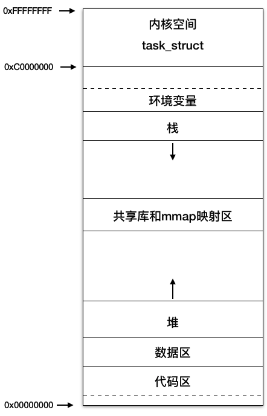
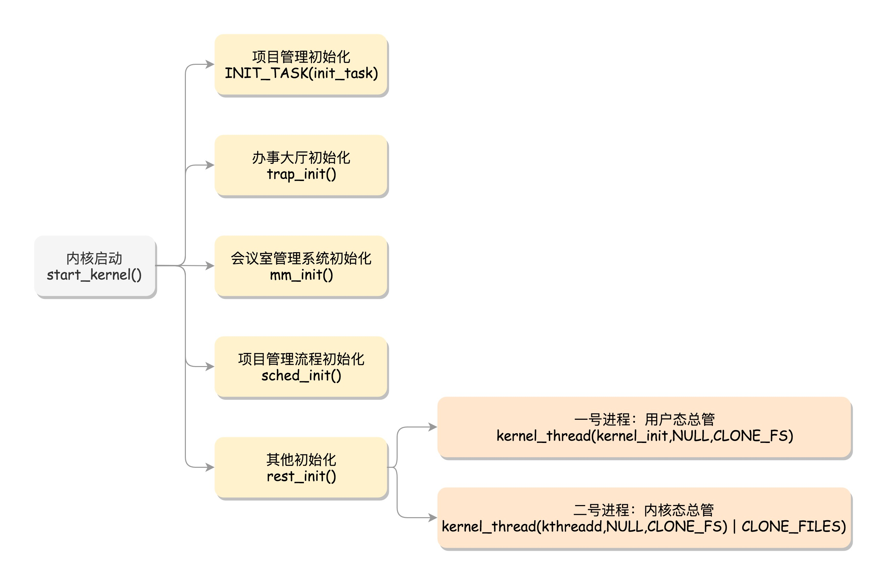

# 内核
## 一. **操作系统的内核态和用户态**
内核：本质上是一种软件，用于控制计算机的硬件资源，包括CPU、存储资源、IO等。内核有自己的空间概念，成为内核空间。

用户态：即上层应用程序的活动空间，应用程序必须依赖于内核提供的资源。

系统调用：为上层应用能访问到内核资源，而供上层应用访问的接口。比如C语言的malloc、printf函数就是封装了一些系统调用，成为了内核和用户态之间的桥梁。又比如，kill 命令调用了 kill() 的这个系统调用（所谓系统调用就是内核的调用接口）而进入到了内核函数 sys_kill()。

进程的虚拟地址空间总体分为用户空间和内核空间，低地址上的 3GB 属于用户空间，高地址的 1GB 是内核空间，这是基于安全上的考虑，用户程序只能访问用户空间，内核程序可以访问整个进程空间，并且只有内核可以直接访问各种硬件资源，比如磁盘和网卡。那用户程序需要访问这些硬件资源该怎么办呢？答案是通过系统调用，系统调用可以理解为内核实现的函数，比如应用程序要通过网卡接收数据，会调用 Socket 的 read 函数。

**为什么程序不直接运行在内核态（这样还免去了用户态和内核态切换的消耗）？**
如果应用程序直接在内核态运行，权限级别太高，出了问题会导致整个操作系统崩溃，所有才有了用户态核心态，算是一种隔离和容错吧。

例如，当一个用户态的程序运行到一半，要访问一个核心资源，例如访问网卡发一个网络包，就需要暂停当前的运行，调用系统调用，接下来就轮到内核中的代码运行了。
如果不分用户态和内核态，可能在用户态，已经就把操作系统搞崩了。

用户空间上还有一个共享库和 mmap 映射区，Linux 提供了内存映射函数 mmap， 它可将文件内容映射到这个内存区域，用户通过读写这段内存，从而实现对文件的读取和修改，无需通过 read/write 系统调用来读写文件，省去了用户空间和内核空间之间的数据拷贝，Java 的 MappedByteBuffer 就是通过它来实现的；用户程序用到的系统共享库也是通过 mmap 映射到了这个区域。

 

## 二. **内核的功能**

- **进程管理**：内核控制着程序的创建、调度、同步、通信和终止。它通过进程表来跟踪活动进程的状态，并使用调度算法决定哪个进程应该获得CPU时间。
  
- **内存管理**：内核负责分配和回收内存空间，包括物理内存和虚拟内存的管理。通过分页或分段机制，内核可以实现地址空间的隔离，使得每个进程都感觉自己独占了整个内存空间。

- **文件系统管理**：内核提供了文件的创建、删除、读写以及目录操作等功能。它还管理磁盘和其他存储设备，通过文件系统抽象，为用户提供统一的数据访问接口。

- **设备驱动管理**：内核与硬件设备交互，通过设备驱动程序来控制硬件的工作，如硬盘、网络适配器等。驱动程序为硬件提供了软件接口，使得上层软件可以无需关心硬件的具体细节。

- **中断处理**：当硬件设备需要服务或有特定事件发生时（如键盘输入、网络数据到达），会生成中断信号。内核负责中断的接收和处理，确保系统能及时响应外部事件。

### 2. **内核类型**

- **微内核**：微内核设计思想是将尽可能多的服务移到用户空间，内核仅保留最基本的功能（如进程通信和内存管理的基本部分）。这样做的目的是提高系统的稳定性和灵活性，但可能牺牲一些性能。

- **宏内核**：宏内核包含了操作系统大多数服务和驱动程序，都在核心态运行。这样的设计有利于提高系统效率，因为减少了用户态到核心态的切换，但可能导致内核体积庞大且不易维护。

- **混合内核**：实际上，现代操作系统往往采用一种混合模式，既保持了宏内核的高效性，又吸取了微内核的一些设计理念，比如模块化的驱动加载和动态卸载能力。

### 3. **内核的实现技术**

- **同步与互斥**：为了保证多任务环境下的数据一致性，内核必须实现锁、信号量等机制来控制对共享资源的访问。

- **虚拟化技术**：通过虚拟内存管理，内核使得每个进程都有独立的地址空间，同时通过页面置换算法来优化物理内存的使用。

- **安全机制**：内核实施权限管理和访问控制（如Unix/Linux的UID/GID，Windows的ACL），以保护系统和用户数据的安全。

操作系统内核是计算机科学中的一个深奥而复杂的领域，它的发展伴随着计算技术的进步而不断演进，从单任务到多任务，从单核CPU到多核并行处理，每一次技术飞跃都对内核的设计提出了新的挑战和要求。

 

## 三. **内核的初始化**
Linux内核的初始化流程是一个高度有序的序列，它从引导加载程序（如GRUB）加载内核映像并跳转到内核入口点开始，直到用户空间的第一个进程（通常是init）运行为止。

以下是Linux内核初始化的主要步骤概览：

1. **硬件探测与设置**：
   - 实模式到保护模式的转换：内核首先确保CPU处于保护模式下，以便利用更高级别的内存管理和保护特性。
   - 开启A20地址线：在较旧的x86系统中，这是必要的，以访问全部内存地址空间。
   - 初始化中断描述符表(IDT)和全局描述符表(GDT)，为后续的中断处理和内存管理做准备。

2. **基本架构初始化**：
   - `setup_arch()`函数：针对特定架构的初始化，包括设置中断向量表、初始化页表、构建基本内存模型等。

3. **内存管理初始化**：
   - 初始化页表：`paging_init()`用于建立内核的地址空间，确保内核可以访问内存。
   - 设置内存布局：确定可用内存区域，为后续的动态内存分配做准备。

4. **中断和异常处理**：
   - `trap_init()`：设置异常和中断服务例程，确保系统能够响应各种硬件事件和错误。

5. **CPU和SMP初始化**：
   - 如果是多处理器系统(SMP)，会初始化SMP支持，包括启动其他CPU核心。

6. **设备驱动初始化**：
   - 静态和动态设备驱动程序的初始化，这通常在后续的初始化调用链中完成，例如通过模块初始化函数。

7. **内核子系统初始化**：
   - 初始化进程调度器(`sched_init()`), 内存管理系统(`mm_init()`), 输入输出子系统等。
   - 初始化系统定时器，用于维持系统时间和提供定时事件。

8. **文件系统与根文件系统挂载**：
   - 初始化文件系统支持，然后挂载根文件系统。这是通过读取启动参数确定根设备，并加载其文件系统实现的。

9. **用户空间准备**：
   - 创建第一个进程，即PID为1的init进程，通常使用`init_task`初始化。这个进程负责后续的系统服务和用户进程的启动。
   - 执行`do_initcalls()`，按顺序调用内核模块的初始化函数。

10. **执行用户空间初始化**：
    - 最后，内核通过执行`execve()`系统调用，运行init程序（如systemd、sysvinit等），标志着内核初始化完成，进入用户空间操作。

这个过程涉及大量的底层代码和硬件交互，每个步骤都是为了确保系统能够在安全和高效的状态下运行。随着Linux内核版本的更新，具体的实现细节可能会有所变化，但上述流程概括了核心步骤。