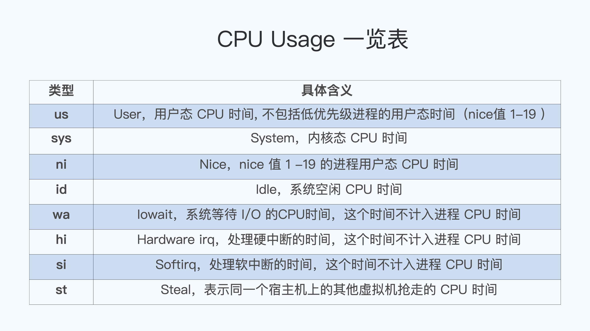

# Linux常用命令
Linux系统中包含了大量命令，涵盖了文件操作、系统管理、网络配置、进程控制等多个方面。以下是一些非常基础且常用的Linux命令及其简要说明：

## 1. **文件与目录操作**

（1）**列出目录内容 (`ls`)**  
   - 示例：列出当前目录下的所有文件和目录（包括隐藏文件）
     ```bash
     ls -la
     ```

（2）**切换目录 (`cd`)**  
   - 示例：从当前位置切换到用户的家目录
     ```bash
     cd ~
     ```

（3）**创建新目录 (`mkdir`)**  
   - 示例：在当前目录下创建名为“new_directory”的目录
     ```bash
     mkdir new_directory
     ```

（4）**创建新文件或更新文件时间戳 (`touch`)**  
   - 示例：在当前目录下创建一个名为“new_file.txt”的空文件
     ```bash
     touch new_file.txt
     ```

（5）**删除文件或目录 (`rm`)**  
   - 示例：删除名为“file_to_delete.txt”的文件
     ```bash
     rm file_to_delete.txt
     ```
   - 示例：递归删除名为“directory_to_delete”的目录及其内容
     ```bash
     rm -r directory_to_delete
     ```

（6）**复制文件或目录 (`cp`)**  
   - 示例：复制“source_file.txt”到当前目录下的“destination_file.txt”
     ```bash
     cp source_file.txt destination_file.txt
     ```
   - 示例：递归复制“source_directory”到“new_location”
     ```bash
     cp -r source_directory new_location/
     ```

（7）**移动或重命名文件或目录 (`mv`)**  
   - 示例：将“file_to_move.txt”移动到“new_directory/”
     ```bash
     mv file_to_move.txt new_directory/
     ```
   - 示例：将“old_name.txt”重命名为“new_name.txt”
     ```bash
     mv old_name.txt new_name.txt
     ```

（8）**查找文件 (`find`)**  
   - 示例：在当前目录及其子目录下查找名为“example.txt”的文件
     ```bash
     find . -name "example.txt"
     ```
   - 示例：查找过去24小时内修改过的文件
     ```bash
     find . -mtime -1
     ```


## 2. **文件内容查看与编辑**

（1）**显示文件内容 (`cat`)**  
   - 示例：显示“example.txt”文件的全部内容
     ```bash
     cat example.txt
     ```

（2）**分页查看文件内容 (`more` 或 `less`)**  
   - 示例（使用`more`）：分页查看“large_file.txt”文件内容
     ```bash
     more large_file.txt
     ```
   - 示例（使用`less`）：使用`less`命令可以更方便地前后翻页查看
     ```bash
     less large_file.txt
     ```

（3）**查看文件开头或结尾部分内容 (`head`、`tail`)**  
   - 示例（查看前5行）：显示“data.txt”文件的前5行
     ```bash
     head -n 5 data.txt
     ```
   - 示例（查看后10行）：显示“log.txt”文件的最后10行
     ```bash
     tail -n 10 log.txt
     ```

（4）**文本编辑器 (`vim` 或 `nano`)**  
   - 示例（使用`vim`编辑）：打开或创建“edit_me.txt”进行编辑
     ```bash
     vim edit_me.txt
     ```
     在`vim`中，按`i`键进入插入模式开始编辑，完成后按`Esc`键退出插入模式，然后输入`:wq`并回车保存并退出编辑器。
   
   - 示例（使用`nano`编辑）：使用更友好的`nano`编辑器编辑“notes.txt”
     ```bash
     nano notes.txt
     ```
     在`nano`中，可以直接开始编辑。完成编辑后，按`Ctrl + O`保存更改，接着按`Ctrl + X`退出编辑器。


## 3. **系统信息与状态**

（1）**显示当前工作目录 (`pwd`)**  
   - 示例：
     ```bash
     pwd
     ```

（2）**打印文本或变量值到标准输出 (`echo`)**  
   - 示例：打印一条消息
     ```bash
     echo "Hello, Linux!"
     ```
   - 示例：显示环境变量`USER`的值
     ```bash
     echo $USER
     ```

（3）**显示或设置系统日期和时间 (`date`)**  
   - 示例：显示当前系统日期和时间
     ```bash
     date
     ```
   - 示例：设置系统时间为2023年4月1日12:00（此操作通常需要管理员权限）
     ```bash
     sudo date 040112002023
     ```

（4）**显示或设置主机名 (`hostname`)**  
   - 示例：显示当前主机名
     ```bash
     hostname
     ```
   - 示例：临时设置主机名为new_hostname（重启后恢复原设置）
     ```bash
     hostname new_hostname
     ```
     注意：永久更改主机名需编辑相关配置文件，如`/etc/hostname`和`/etc/hosts`。

（5）**实时显示系统进程及其资源占用情况 (`top`)**  
   - 示例：
     ```bash
     top
     ```
     运行后，按`q`键退出。

     

（6）**显示磁盘空间使用情况 (`df`)**  
   - 示例：查看磁盘空间使用情况，包括挂载点、总大小、已用空间、可用空间等
     ```bash
     df -h
     ```

（7）**显示系统内存使用情况 (`free`)**  
   - 示例：查看内存和交换分区的使用情况，以易读格式展示
     ```bash
     free -h
     ```


## 4. **权限与用户管理**

（1）**修改文件或目录的权限 (`chmod`)**  
   - 示例：给文件“example.txt”设置所有用户可读、所有者可写可执行的权限
     ```bash
     chmod u+xrw,g+r,o+r example.txt
     ```
   u（所有者）、g（所属组）、o（其他人）、a（所有用户，即u、g、o的组合）

   或使用数字表示法：
     ```bash
     chmod 744 example.txt
     ```
     4-r, w-2, x-1, 7=rwx

（2）**更改文件或目录的所有者 (`chown`)**  
   - 示例：将文件“document.txt”的所有者改为用户“john”
     ```bash
     chown john document.txt
     ```
   改变所有者并同时改变所属组：
     ```bash
     chown john:developers document.txt
     ```

（3）**更改文件或目录的所属组 (`chgrp`)**  
   - 示例：将文件“project_plan.txt”的所属组改为“teamA”
     ```bash
     chgrp teamA project_plan.txt
     ```

（4）**切换用户身份 (`su`)**  
   - 示例：切换到root用户
     ```bash
     su -
     ```
   若要切换到其他用户，例如用户“alice”：
     ```bash
     su alice
     ```

（5）**以其他用户身份执行命令 (`sudo`)**  
   - 示例：以root权限运行更新操作
     ```bash
     sudo apt-get update
     ```
   或执行特定命令作为其他用户（比如以user2身份执行ls命令）：
     ```bash
     sudo -u user2 ls /home/user2
     ```

## 5. **网络相关**

**(1) `ifconfig`（或`ip addr`）：查看和配置网络接口。**

- (1.1) 实例（查看所有网络接口状态）:
  ```
  sudo ifconfig -a
  ```
- 或者，对于现代系统，使用 `ip` 命令：
  ```
  ip addr show
  ```
- (1.2) 实例（配置网络接口IP地址）:
  ```
  sudo ifconfig eth0 192.168.1.10 netmask 255.255.255.0 up
  ```
- 使用 `ip` 命令的配置示例：
  ```
  sudo ip addr add 192.168.1.10/24 dev eth0
  ```

**(2) `ping`：测试与另一台主机的网络连接。**

- (2.1) 实例：
  ```
  ping www.example.com
  ```

**(3) `netstat`：显示网络连接、路由表、网络接口统计等信息。**

- (3.1) 实例（显示所有活动的网络连接）:
  ```
  netstat -tuln
  ```
- (3.2) 实例（显示监听中的TCP端口）:
  ```
  netstat -lt
  ```

**(4) `curl`：下载或获取URL内容。**

- (4.1) 实例（下载一个网页的HTML内容）:
  ```
  curl https://www.example.com
  ```
- (4.2) 或者保存为文件：
  ```
  curl -o example_page.html https://www.example.com
  ```

## 6. **软件包管理**
   - `apt-get`（Ubuntu/Debian）：软件包安装、更新和管理。
   - `yum`（旧版CentOS/RHEL）：软件包安装、更新和管理。
   - `dnf`（CentOS 8+/Fedora）：软件包安装、更新和管理。

## 7. **进程管理**

**(1) `ps`：显示当前进程状态。**

- (1.1) 实例（显示所有当前用户的进程）:
  ```
  ps aux
  ```
- (1.2) 显示包含特定关键词的进程，例如显示所有包含 "python" 的进程：
  ```
  ps aux | grep python
  ```

**(2) `kill`：发送信号给进程，通常用来终止进程。**

- (2.1) 实例（终止进程ID为1234的进程）:
  ```
  kill 1234
  ```
- (2.2) 使用信号SIGTERM（默认）优雅地终止进程，如果进程没有响应，可以使用SIGKILL（-9）强制终止：
  ```
  kill -9 1234
  ```

**(3) `bg`、`fg`：后台、前台运行作业。**

这里首先需要理解，`bg` 和 `fg` 通常用于与作业控制有关的操作，它们作用于通过 `&` 运行在后台的命令或者之前暂停的命令。

- (3.1) 实例（将一个命令放到后台运行）:
  ```
  sleep 100 &  # 运行sleep命令并立即放入后台
  ```
- (3.2) 使用 `jobs` 查看后台作业状态：
  ```
  jobs
  ```
- (3.3) 实例（将后台的作业调回前台运行）:
  ```
  fg %1  # 假设sleep命令是作业列表中的第一个，用%1指定
  ```
- (3.4) 实例（将当前作业放到后台）:
  如果一个程序正在前台运行，你可以按下 `Ctrl+Z` 将其暂停，然后使用 `bg` 放到后台继续执行：
  ```
  ^Z  # 暂停当前进程
  bg  # 将暂停的进程放到后台继续执行
  ```

请注意，使用这些命令时，根据具体操作系统和shell环境，细节可能略有不同。

## 8. **文件压缩与解压**
**(1) `tar`：打包、压缩或解压文件。**

- (1.1) 实例（打包目录 `my_directory` 到 `archive.tar`）:
  ```
  tar -cvf archive.tar my_directory
  ```
- (1.2) 实例（使用gzip压缩 `archive.tar` 成 `archive.tar.gz`）:
  ```
  tar -czvf archive.tar.gz my_directory
  ```
- (1.3) 实例（解压 `archive.tar.gz` 到当前目录）:
  ```
  tar -xzvf archive.tar.gz
  ```

**(2) `gzip`、`gunzip`：压缩、解压文件。**

- (2.1) 实例（压缩文件 `file.txt` 成 `file.txt.gz`）:
  ```
  gzip file.txt
  ```
- (2.2) 实例（解压 `file.txt.gz` 回到 `file.txt`）:
  ```
  gunzip file.txt.gz
  ```

**(3) `zip`、`unzip`：创建、解压ZIP格式的压缩文件。**

- (3.1) 实例（将目录 `my_directory` 打包成 `archive.zip`）:
  ```
  zip -r archive.zip my_directory
  ```
- (3.2) 实例（解压 `archive.zip` 到当前目录）:
  ```
  unzip archive.zip
  ```