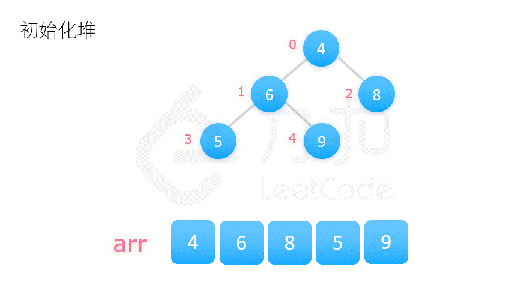

# heapsort

## 什么是堆
堆就是符合以下两个条件之一的完全二叉树：
- 根节点的值 ≥ 子节点的值，这样的堆被称之为最大堆，或大顶堆；
- 根节点的值 ≤ 子节点的值，这样的堆被称之为最小堆，或小顶堆。

 

## 堆排序过程
1. 用数列构建出一个大顶堆，取出堆顶的数字；
2. 调整剩余的数字，构建出新的大顶堆，再次取出堆顶的数字；
3. 循环往复，完成整个排序。

需要解决的问题有两个：
- 1. 如何用数列构建出一个大顶堆；
- 2. 取出堆顶的数字后，如何将剩余的数字调整成新的大顶堆。

 

## 构建大顶堆 & 调整堆
构建大顶堆有两种方式：
- 方案一：从 0 开始，将每个数字依次插入堆中，一边插入，一边调整堆的结构，使其满足大顶堆的要求；
- 方案二：将整个数列的初始状态视作一棵完全二叉树，自底向上调整树的结构，使其满足大顶堆的要求。

 

## 时间复杂度和空间复杂度
初始化建堆的时间复杂度为 O(n)，重建堆的时间复杂度为 O(nlogn)，所以堆排序总的时间复杂度为 O(nlogn)。

堆排序的空间复杂度为 O(1)，只需要常数级的临时变量。
