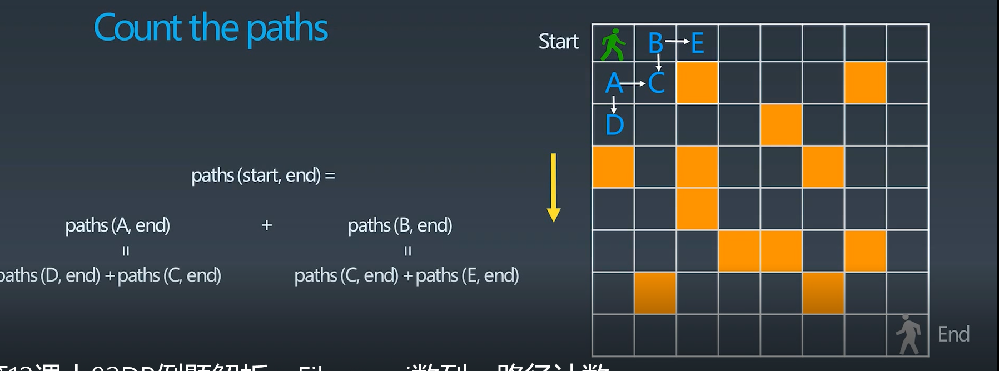

# 动态规划
1. 递归、分治、动态规划，都是将复杂的问题分解为多个简单的子问题进行求解。
2. 动态规划问题本质上就是一个递归或分治问题，但是动态规划有一个最优子结构，比如一般会让求解一个最优解、最大值等等。
3. 动态规划思路：找到重复子问题，中途淘汰次优解，找状态转移方程。可以理解为“动态递推”。
4. 复杂一点的递归会变为二维、三维。
   

## 动态规划例子
路径问题：

 

## 背包问题
https://zhuanlan.zhihu.com/p/139368825