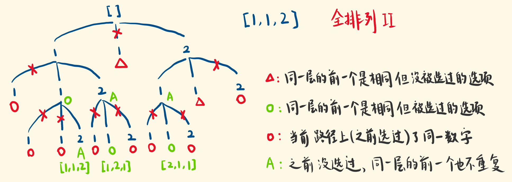

# 递归
递归，即自己调用自己。

递归有两种方式，以斐波那契为例子：

1. 自顶向下： 比如f(6) = f(5) + f(4), 再分别解：
```
f(5) = f(4) + f(3)
f(4) = f(3) + f(2)
......
```
这就是从问题出发，去不断求子问题。

2. 自底向上： 要求f(6), 先求得f(1), f(2)，那么：
```
f(3) = f(1) + f(2)
f(4) = f(2) + f(3)
......
```
最终求得f(6)

<br>

## 自顶向下代码模版：
```
// Java
public void recur(int level, int param) {   
	// terminator  
	 if (level > MAX_LEVEL) {     
		// process result     return;  
	 }  
	// process current logic   
	process(level, param);  
	
	// drill down   
	recur( level: level + 1, newParam);   
	
	// restore current status 
}
```


## 递归例子
全排列：

