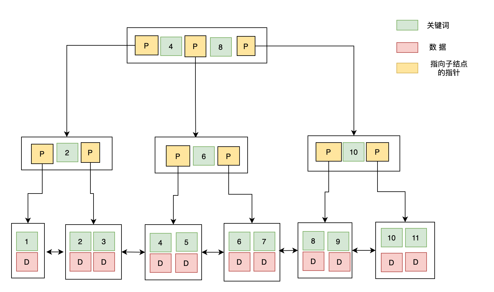

# B树和B+树

## B-Tree
一棵 m 阶 B-Tree 的特性如下：
- 每个结点最多 m 个子结点；
- 除了根结点和叶子结点外，每个结点最少有 m/2（向上取整）个子结点；
- 所有的叶子结点都位于同一层；
- 每个结点都包含 k 个元素（关键字），这里 m/2 ≤ k < m，这里 m/2 向下取整；
- 每个节点中的元素（关键字）从小到大排列；
- 每个元素子左结点的值，都小于或等于该元素，右结点的值都大于或等于该元素。

数据库以 B-Tree 的数据结构存储数据的图示如下：

 

## B+ Tree
B+ Tree 与 B-Tree 的结构很像，但是也有自己的特性：
- 所有的非叶子结点只存储 关键字信息；
- 所有具体数据都存在叶子结点中；
- 所有的叶子结点中包含了全部元素的信息；
- 所有叶子节点之间都有一个链指针。

数据库以 B+ Tree 的数据结构存储数据的图示如下:

### 使用 B+ 树的好处
由于 B+ 树的内部结点只存放键，不存放值，因此，一次读取，可以在同一内存页中获取更多的键，有利于更快地缩小查找范围。

B+ 树的叶结点由一条链相连，因此当需要进行一次 全数据遍历 的时候，B+ 树只需要使用 O(logN) 时间找到最小结点，然后通过链进行 O(N) 的顺序遍历即可；
或者，在找 大于某个关键字或者小于某个关键字的数据 的时候，B+ 树只需要找到该关键字然后沿着链表遍历即可。

 

## 为什么要用B树或者B+树来做索引结构
AVL树的高度要比B树或者B+树的高度更高，而高度就意味着磁盘IO的数量，
为了减少磁盘IO的次数，文件系统或者数据库才会使用B树，或者B+树来做索引结构。

在比较经典的程序应用中，MongoDB使用的是B树，MongoDB中所有的节点都有Data域，只要找到指定索引就可以进行访问，无疑单次查询会更快。

MySQL作为一个关系型数据库，数据的关联性是非常强的，区间访问是常见的一种情况，B+树由于数据全部存储在叶子节点，并且通过指针串在一起，
这样就很容易的进行区间遍历甚至全部遍历。