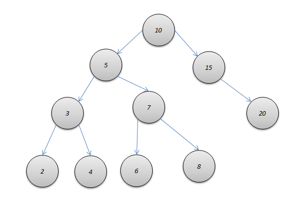
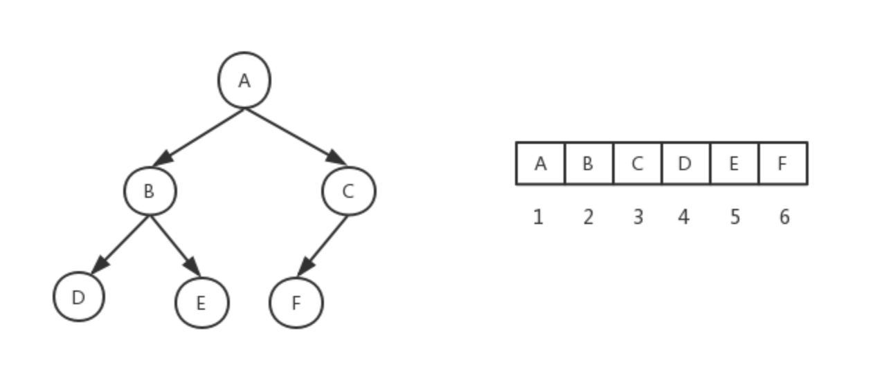

# 树的一些概念

## 二叉搜索树

左子树比当前节点值小，右子树值比当前节点值大。

 

## 前驱后后继
前驱节点val值小于该节点val值、并且值最大的节点   左->右->...右

后继节点val值大于该节点val值、并且值最小的节点   右->左->...左

 

## 满二叉树
满二叉树，即叶子节点外，所有节点都有两个子节点

 

## 完全二叉树
完全二叉树是由满二叉树而引出来的，若设二叉树的深度为h，除第 h 层外，其它各层 (1～h-1) 的结点数都达到最大个数(即1~h-1层为一个满二叉树)，
第 h 层所有的结点都连续集中在最左边，这就是完全二叉树。

将根节点的下标视为 0，则完全二叉树有如下性质：
- 对于完全二叉树中的第 i 个数，它的左子节点下标：left = 2i + 1
- 对于完全二叉树中的第 i 个数，它的右子节点下标：right = left + 1
- 对于有 n 个元素的完全二叉树(n≥2)，它的最后一个非叶子结点的下标：n/2(向上取整) - 1

 

## 平衡二叉树
任意节点的子树的高度差都小于等于 1