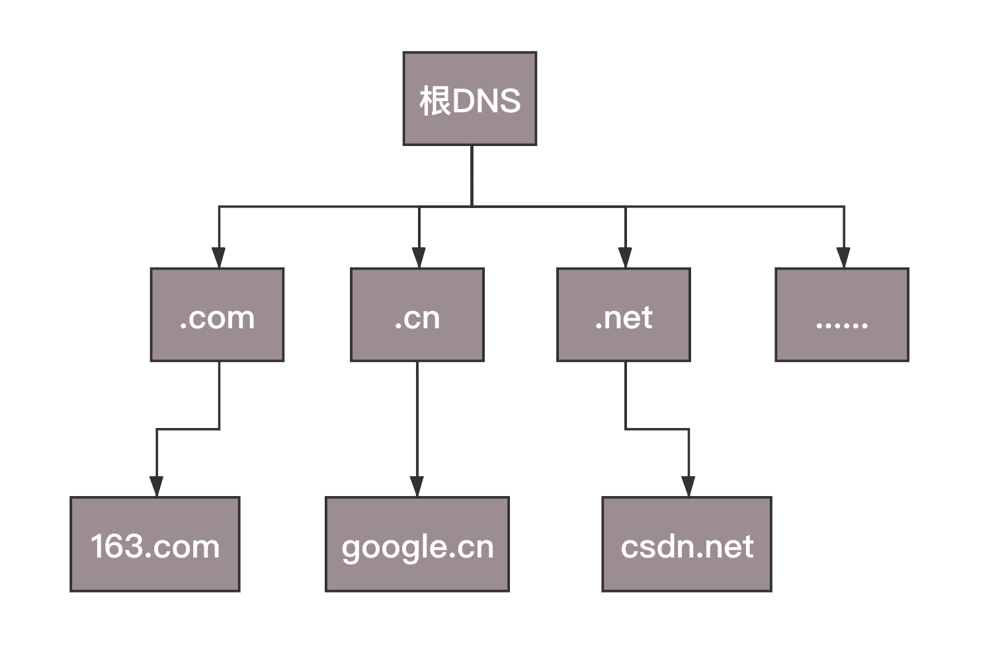
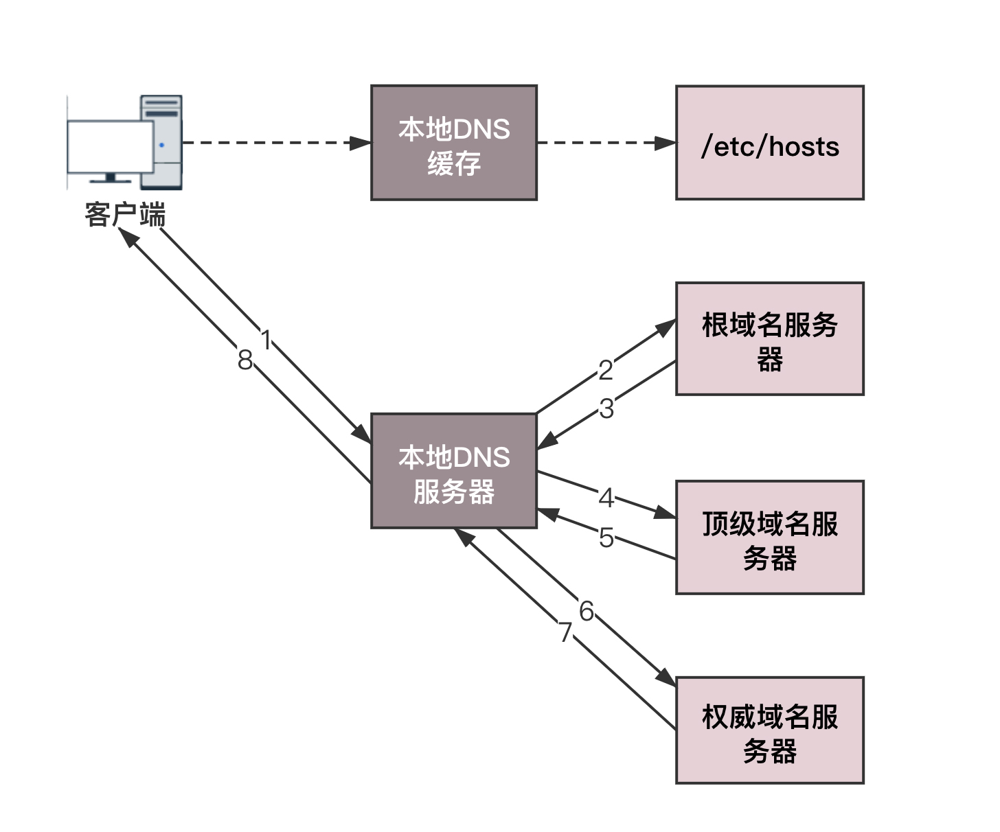

# dns
你肯定记得住网站的名称，但是很难记住网站的 IP 地址，因而也需要一个地址簿，就是 DNS 服务器.
DNS 在日常生活中多么重要。每个人上网，都需要访问它，但是同时，这对它来讲也是非常大的挑战。
一旦它出了故障，整个互联网都将瘫痪。
上网的人分布在全世界各地，如果大家都去同一个地方访问某一台服务器，时延将会非常大。
因而，DNS 服务器，一定要设置成高可用、高并发和分布式的。
于是，就有了树状的层次结构。

 

## 1. DNS按层级分类
- 根 DNS 服务器 ：返回顶级域 DNS 服务器的 IP 地址
- 顶级域 DNS 服务器：返回权威 DNS 服务器的 IP 地址
- 权威 DNS 服务器 ：返回相应主机的 IP 地址

 

## 2. DNS的解析过程

 

## 3. 负载均衡
DNS 除了可以通过名称映射为 IP 地址，它还可以做另外一件事，就是负载均衡。

1）内部负载均衡

例如，一个应用要访问数据库，在这个应用里面应该配置这个数据库的 IP 地址，还是应该配置这个数据库的域名呢？
显然应该配置域名，因为一旦这个数据库，因为某种原因，换到了另外一台机器上，
而如果有多个应用都配置了这台数据库的话，一换 IP 地址，就需要将这些应用全部修改一遍。
但是如果配置了域名，则只要在 DNS 服务器里，将域名映射为新的 IP 地址，这个工作就完成了，大大简化了运维。

2）全局负载均衡

为了保证我们的应用高可用，往往会部署在多个机房，每个地方都会有自己的 IP 地址。
当用户访问某个域名的时候，这个 IP 地址可以轮询访问多个数据中心。
如果一个数据中心因为某种原因挂了，只要在 DNS 服务器里面，将这个数据中心对应的 IP 地址删除，
就可以实现一定的高可用。

 

## 4. 传统DNS存在的问题
### 1）缓存问题
可能指向变了，但是缓存没更新；也可能缓存没更新，导致饶了远路。

### 2）域名转发问题
A运营商的客户，如果A 运营商偷懒，将解析的请求转发给 B 运营商，B 运营商去权威 DNS 服务器查询的话，
权威服务器会误认为，你是 B 运营商的客户，那就返回给你一个在 B 运营商的网站地址吧，
结果客户的每次访问都要跨运营商，速度就会很慢。

### 3）出口NAT问题
很多机房都会配置 NAT，也即网络地址转换，使得从这个网关出去的包，都换成新的 IP 地址，
当然请求返回的时候，在这个网关，再将 IP 地址转换回去，所以对于访问来说是没有任何问题。
但是一旦做了网络地址的转换，权威的 DNS 服务器，就没办法通过这个地址，来判断客户到底是来自哪个运营商，
而且极有可能因为转换过后的地址，误判运营商，导致跨运营商的访问。

### 4）延迟
DNS 的查询过程需要递归遍历多个 DNS 服务器，才能获得最终的解析结果，这会带来一定的时延。

### 5）域名更新问题
跨机房的负载均衡和容灾多使用 DNS 来做。当一个机房出问题之后，需要修改权威 DNS，将域名指向新的 IP 地址，
但是如果更新太慢，那很多用户都会出现访问异常。

 

## 5. HttpDNS 
为了解决5中到的问题，出现了HttpDNS

HttpDNS 其实就是，不走传统的 DNS 解析，而是自己搭建基于 HTTP 协议的 DNS 服务器集群，
分布在多个地点和多个运营商。当客户端需要 DNS 解析的时候，直接通过 HTTP 协议进行请求这个服务器集群，
得到就近的地址。

使用 HttpDNS 需要绕过默认的 DNS 路径，就不能使用默认的客户端。
使用 HttpDNS 的，往往是手机应用，需要在手机端嵌入支持 HttpDNS 的客户端 SDK。

一方面，解析的过程，不需要本地 DNS 服务递归的调用一大圈，一个 HTTP 的请求直接搞定，要实时更新的时候，
马上就能起作用；

另一方面为了提高解析速度，本地也有缓存，缓存是在客户端 SDK 维护的，过期时间、更新时间，都可以自己控制。

httpdns服务器的地址一般不变 可以使用dns的方式获取httpdns服务器的ip地址,
也可以直接把httpdns服务器的ip地址写死在客户端中。