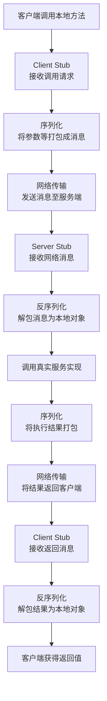

# RPC框架的组成
好的，我们用一个通俗易懂的方式来全面讲解一下 RPC 框架。

### 一、什么是 RPC？—— 从一个比喻开始

想象一下，你想调用一个函数（比如 `getUserInfo(123)`）来获取用户信息。

*   **本地函数调用**：如果这个函数就在你当前的程序中，你直接调用它，程序跳转到函数地址执行，然后返回结果。这非常高效和简单。
*   **远程函数调用**：但如果这个函数（或者说处理这个请求的逻辑）在另一台服务器的另一个程序里，你该怎么办？这就是 RPC 要解决的问题。

**RPC（Remote Procedure Call）**，即远程过程调用，它的目标就是：**让调用远程服务像调用本地函数一样简单自然。**

继续用比喻：
你（客户端程序）想问你远方的朋友（服务端程序）一个问题。你不会“瞬间移动”过去当面问他，而是会**打电话**。

*   **打电话这个行为**，就像是 RPC 调用。对你来说，你只是拿起电话说了一句“嗨，今天天气怎么样？”，你就得到了答案。你并不关心声音是如何通过基站、光缆传输到对方耳朵里的。
*   **电话系统（包括手机、基站、网络等）**，就是 RPC 框架。它隐藏了通信的复杂细节。

所以，RPC 框架的核心价值在于 **封装** 和 **简化**，将网络通信、序列化/反序列化等复杂细节封装起来，让开发者只需关注业务逻辑。

---

### 二、为什么需要 RPC 框架？

没有 RPC 框架，你需要直接使用 Socket API 自己处理：
1.  创建 Socket 连接。
2.  将参数对象转换成字节流（序列化）。
3.  通过 Socket 发送字节流。
4.  在服务端监听、接收字节流。
5.  将字节流转换回参数对象（反序列化）。
6.  找到并调用本地函数。
7.  将返回值或异常结果再经过序列化、网络传输返回给客户端。
8.  处理超时、重试、连接池管理等。

这个过程非常繁琐、易错，且与业务逻辑耦合。RPC 框架就是为了自动化这些步骤而生的。

---

### 三、RPC 框架的核心组成

一个成熟的 RPC 框架通常包含以下核心组件，我们可以结合“打电话”的比喻来理解：

#### 1. 客户端（服务消费者）
*   **职责**：调用远程服务的发起方。
*   **比喻**：**打电话的你**。

#### 2. 服务端（服务提供者）
*   **职责**：包含实际业务实现，监听并处理来自客户端的调用请求。
*   **比喻**：**接电话的朋友**。

#### 3. 客户端存根（Client Stub）
*   **职责**：这是 RPC 的魔法所在。它伪装成本地对象，对调用方透明。
    *   当你调用 `userService.getUser(123)` 时，你实际上调用的是 Stub 生成的一个代理对象。
    *   Stub 负责将调用信息（方法名、参数等）打包成消息（序列化），并交给网络模块发送。
*   **比喻**：**你的“智能助理”**。你告诉助理“帮我问一下朋友天气怎么样”，助理负责把这句话翻译成电话信号、拨号、并转达你的问题。

#### 4. 服务端存根（Server Stub）
*   **职责**：接收网络模块传来的消息，将其解包（反序列化），根据解包后的信息（如方法名）调用服务端真正的实现方法，然后将执行结果打包返回。
*   **比喻**：**你朋友的“语音信箱”**。它接收电话信号，转换成“今天天气怎么样”这句话，然后递给你朋友。等你朋友回答后，又把答案“晴天”转换成信号传回给你的助理。

#### 5. 序列化/反序列化（Serialization/Deserialization）
*   **职责**：
    *   **序列化**：将 Java/Python/Go 等语言中的对象转换成可以在网络中传输的字节序列。
    *   **反序列化**：将接收到的字节序列转换回程序可理解的对象。
*   **常见技术**：JSON, XML, Protobuf, Thrift, Avro, Kryo 等。选择时需权衡性能（速度、体积）、可读性、跨语言支持。
*   **比喻**：**“翻译官”**。负责把一种语言（编程语言的对象）翻译成另一种通用的电报码（字节流），以便传输。

#### 6. 网络通信（Transport）
*   **职责**：负责在客户端和服务端之间可靠地传输序列化后的数据。
*   **底层协议**：通常基于 TCP 或 HTTP/1.1/2。更高效的 RPC 框架会自定义基于 TCP 的二进制协议。
*   **通信方式**：同步、异步、单向、流式等。
*   **比喻**：**“电话网络”**。负责把电信号从A点传到B点。

#### 7. 服务注册与发现（Service Registry & Discovery）
*   **职责**：在微服务架构中，服务实例是动态变化的（扩缩容、宕机）。服务提供者将自己的地址（IP:Port）**注册**到注册中心。服务消费者从注册中心**发现**或**拉取**可用的服务地址列表。
*   **常见组件**：Nacos, Consul, Zookeeper, Etcd。
*   **比喻**：**“114查号台”或“手机通讯录”**。你的朋友搬家换了号码（服务实例地址变化），他会在114登记新号码（注册）。你想找他时，不需要记住他的具体号码，只需查114（发现）就能拿到最新号码。

#### 8. 负载均衡（Load Balancing）
*   **职责**：当一个服务有多个实例时，客户端需要决定调用哪一个。负载均衡策略旨在将请求合理地分发到各个实例上，避免单个实例压力过大。
*   **常见策略**：随机、轮询、最少连接数、一致性哈希等。
*   **比喻**：**“客服总机”**。一个公司有多个客服，打进来的电话会被总机自动转接到当前空闲的客服座位上。

#### 9. 容错机制（Fault Tolerance）
*   **职责**：当一次调用失败时（网络超时、服务宕机），框架应该如何处理，以保证系统的鲁棒性。
*   **常见策略**：快速失败、重试、故障转移（Failover）、安全失败（Failsafe）等。
*   **比喻**：**打电话时的“重拨”功能**。第一次打过去占线（失败），你可以选择立即重拨（重试），或者打给另一个朋友问问看（故障转移）。

#### 10. 监控治理（Monitoring & Governance）
*   **职责**：为运维和开发提供可观测性。
    *   **监控**：统计调用量、响应时间、成功率等指标。
    *   **治理**：动态配置（超时时间、熔断规则）、限流、降级、链路追踪。
*   **比喻**：**“通话详单”和“网络质量报告”**。帮你了解打了多少电话、通了多久、信号好不好。

---

### 四、一个典型的 RPC 调用流程

一次完整的 RPC 调用，其内部流程如下图所示，它清晰地展示了上述组件如何协同工作：

### 五、常见的 RPC 框架

*   **gRPC**：Google 开源的高性能、跨语言 RPC 框架，基于 HTTP/2 和 Protobuf。
*   **Apache Thrift**：Facebook 开源的高效、跨语言的 RPC 框架。
*   **Dubbo**：阿里巴巴开源的 Java 高性能 RPC 框架，功能丰富，是微服务治理的优秀选择。
*   **Spring Cloud Feign**：基于 Spring Cloud 的声明式、模板化的 HTTP 客户端，使用非常简便。

### 总结

| 组成部分 | 核心职责 | 类比 |
| :--- | :--- | :--- |
| **客户端/服务端** | 业务逻辑的发起方与实现方 | 打电话的双方 |
| **客户端/服务端存根** | 封装调用细节，实现透明远程调用 | 双方的智能助理 |
| **序列化/反序列化** | 将对象与字节流互相转换 | 翻译官 |
| **网络通信** | 数据传输的通道 | 电话网络 |
| **服务注册与发现** | 动态管理服务地址 | 114查号台 |
| **负载均衡** | 合理分配请求到多个实例 | 客服总机 |
| **容错机制** | 处理调用失败的情况 | 重拨功能 |
| **监控治理** | 保证系统可观测性与可控性 | 通话详单与网络报告 |