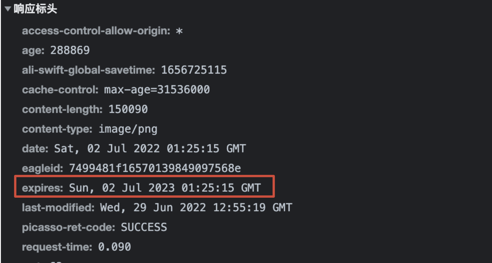

# http cache

## expires
http 1.0中定义的header，是最基础的浏览器缓存处理，表示资源在一定时间内从浏览器的缓存中获取资源，不需要请求服务器获取资源，从而达到快速获取资源，缓解服务器压力的目的。

在response的header中的格式为：Expires: Thu, 01 Dec 1994 16:00:00 GMT （必须是GMT格式）

expires 是一个绝对时间，本地时间可能跟服务器时间不⼀致, 就会导致问题。

应用：
- 可以在html页面中添加<meta http-equiv="Expires" content="Thu, 01 Dec 1994 16:00:00"/> 来给页面设置缓存时间；
- 对于图片、css等文件则需要在IIS或者apache等运行容器中进行规则配置来让容器在请求资源的时候添加在responese的header中。

 

## cache-control
为了解决 expires 绝对时间的问题，http 1.1引入了cache-control, 可以通过max-age设置最大缓存时间：
- max-age=num(s)，设置最⼤缓存时间
- public，缓存能被多⽤户共享
- private，缓存不能在⽤户间共享
- no-cache，不会被缓存
- no-store，不能被存储

如果max-age和expires同时存在，则expires被Cache-Control的max-age覆盖。

此时，expires = max-age + “每次下载时的当前的request时间”。

所以，一旦重新下载的页面后，expires就重新计算一次，但last-modified不会变化。

 

## last-modified
望文知义，根据这个词条的直译应该是上次修改（时间），通过修改服务器端的文件后再请求，发现response的header中的last-modified改变了。

更新原理：

1. 在浏览器首次请求某个资源时，服务器端返回的状态码是200 （ok），内容是你请求的资源，同时有一个last-modified的属性标记(Reponse Header)，标识此文件在服务期端最后被修改的时间，格式：last-modified:Tue, 24 Feb 2009 08:01:04 GMT

2. 浏览器第二次请求该资源时，根据HTTP协议的规定，浏览器会向服务器传送If-Modified-Since报头(Request Header)，询问该文件是否在指定时间之后有被修改过，格式为：If-Modified-Since:Tue, 24 Feb 2009 08:01:04 GMT

3. 如果服务器端的资源没有变化，则服务器返回304状态码（Not Modified），内容为空，这样就节省了传输数据量。当服务器端代码发生改变，则服务器返回200状态码（ok），内容为请求的资源，和第一次请求资源时类似。从而保证在资源没有修改时不向客户端重复发出资源，也保证当服务器有变化时，客户端能够及时得到最新的资源。

注意事项：
- 如果If-Modified-Since的时间比服务器当前时间(当前的请求时间request_time)还晚，会认为是个非法请求;
- 有CDN的场景，如果切换了CDN访问（访问的机器变了），last-modified可能会不同。

使用last-modified, 在资源未修改时返回的response内容为空，可以节省一点带宽，但是还是逃不掉发一个HTTP请求出去，需要浏览器连接一次服务器端。

expires(cache-control)标识使得浏览器干脆连HTTP请求都不用发。但是，当用户使用F5或者点击Refresh按钮强制刷新的时候，就算URI设置了expires，浏览器一样也会发一个HTTP请求给服务器端。

所以，last-modified要和expires一起用。

 

## etag
http 1.1中增加的header，HTTP协议规格说明定义 etag 为“被请求变量的实体值” 。另一种说法是，etag是一个可以与Web资源关联的记号（token）。典型的Web资源可以是一个Web页，但也可能是JSON或XML文档。服务器单独负责判断记号是什么及其含义，并在HTTP响应头中将其传送到客户端。

### etag 的格式
不同类型的Web服务器生成 etag 的策略以及生成的格式是不同的：
- apache1.3和2.x的Etag格式是：inode-size-timestamp。
- IIS5.0和6.0的Etag格式: Filetimestamp:Changenumber。

更新原理：

1. 当浏览器首次请求资源的时候，服务器会返回200的状态码（ok）,内容为请求的资源，同时response header会有一个 etag 标记，该标记是服务器端根据容器（IIS或者Apache等等）中配置的ETag生成策略生成的一串唯一标识资源的字符串，etag 格式为 etag:"856247206"

2. 当浏览器第2次请求该资源时，浏览器会在传递给服务器的request中添加If-None-Match报头，询问服务器改文件在上次获取后是否修改了，报头格式：If-None-Match:"856246825"

3. 服务器在获取到浏览器的请求后，会根据请求的资源查找对应的ETag，将当前服务器端指定资源对应的 etag 与request中的If-None-Match进行对比，如果相同，说明资源没有修改，服务器返回304状态码（Not Modified），内容为空；如果对比发现不相同，则返回200状态码，同时将新的Etag添加到返回浏览器的response中。

etag和last-modified的情况类似，需要expires控制请求的频率，etag在强制刷新时作为保障。

 

## last-modified和etag
从资源更新原理来看last-modified和etag基本是类似的，那为什么http协议中要搞2个标识呢？

last-modified存在的问题：
- 1. 在集群服务器上各个服务器上的文件时间可能不同, 所以在分布式系统里多台机器间文件的last-modified必须保持一致，以免负载均衡到不同机器导致比对失败。
- 2. 如果用旧文件覆盖新文件，因为时间更前，浏览器不会请求这个更旧的文件；
- 3. 时间精度为s级，对文件修改精度有严格要求的场景不能满足。

为什么淘宝和腾讯没有使用etag？

从图中看出，nginx生成的etag, 是用“最后修改时间 last-modified + 文件内容长度”来生成etag, 而CDN每次回源都会导致最后修改时间变化（回源是指浏览器在发送请求报文时，响应该请求报文的是源站点的服务器，而不是各节点上的缓存服务器），使用etag就没有意义了，不如直接使用last-modified。