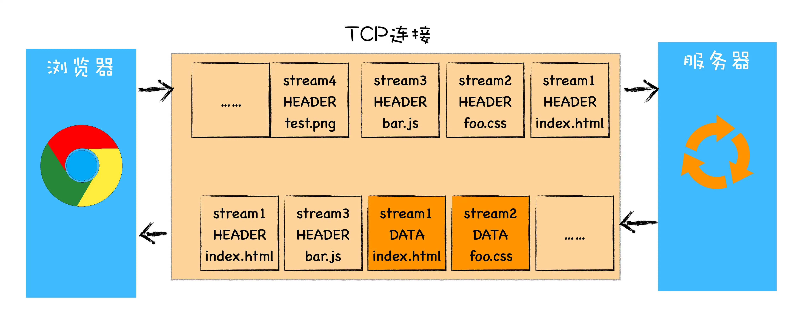

# http
谈及浏览器中的网络，就避不开 HTTP。我们知道 HTTP 是浏览器中最重要且使用最多的协议，是浏览器和服务器之间的通信语言，也是互联网的基石。而随着浏览器的发展，HTTP 为了能适应新的形式也在持续进化。

## 1. http常见状态码码
- 2xx 成功 : 
   - 200: 成功响应  
   - 201: 有新资源在服务器端创建成功
   - 202：服务器处理异步请求
   - 204: 执行成功了请求不携带响应包体，并且不刷新页面
- 3xx 重定向： 
   - 301会缓存（请求A缓存B,下一次就直接请求B了）
   - 302不会缓存
- 4xx 客户端错误，
   - 404：为找不到资源，
   - 400：为参数请求错误，
   - 401：为身份认证不通过，
   - 403：是没权限，
   - 413：包体过长，
- 5xx 服务器端错误
  - 502 Bad Gateway 是 HTTP 状态码的一种，表示服务器作为网关或代理，从上游服务器收到无效响应。就是当用户向网站发送请求时，请求会经过多个服务器处理，如果其中一个服务器（通常是反向代理服务器或负载均衡器）未能从上游服务器接收到有效的响应，就会返回 502 错误。

## 2. WSGI 网络服务网关接口
开发者实现一个函数就能响应http请求，使开发者不需要去关注TCP连接、以及http响应的格式，即不需要开发者去解析底层协议

## 3. HTTP 1.1 的请求报文
大概分为三大部分。第一部分是请求行，第二部分是请求的首部，第三部分才是请求的正文实体。
- 1) 在请求行中，主要是URL和方法（GET、POST、PUT、DELETE）
- 2) 首部字段，
  - Accept-Charset，表示客户端可以接受的字符集。防止传过来的是另外的字符集，从而导致出现乱码。
  - Content-Type 是指正文的格式，比如我们进行 POST 的请求，如果正文是 JSON，那么我们就应该将这个值设置为 JSON。
  - 再比如text/html表示网页。浏览器根据这个字段判定是网页，图片，视频还是音乐。
  - Cache-control 是用来控制缓存的。当客户端发送的请求中包含 max-age 指令时，如果判定缓存层中，资源的缓存时间数值比指定时间的数值小，那么客户端可以接受缓存的资源；
  - 当指定 max-age 值为 0，那么缓存层通常需要将请求转发给应用集群。
  - If-Modified-Since 也是一个关于缓存的。也就是说，如果服务器的资源在某个时间之后更新了，那么客户端就应该下载最新的资源；如果没有更新，服务端会返回“304 Not Modified”的响应，那客户端就不用下载了，也会节省带宽。

## 4. HTTP 1.1的返回报文格式
- 1） 状态码，比如200，400，404，500等
- 2） 首部字段
  - Retry-After 表示，告诉客户端应该在多长时间以后再次尝试一下。“503 错误”是说“服务暂时不再和这个值配合使用”。
  - Content-Type，表示返回的是 HTML，还是 JSON。

### HTTP 1.1缺点
HTTP 1.1 在应用层以纯文本的形式进行通信。每次通信都要带完整的 HTTP 的头，而且不考虑 pipeline 模式的话，
每次的过程总是像上面描述的那样一去一回。这样在实时性、并发性上都存在问题。
http返回报文中，如果带了Content-Length，则指定了报文长度。如果没有，则说明报文是变长的。
如果使用了压缩，一般来说都是变长的。

## 5. HTTP 2.0
- 1）HTTP 2.0 会对 HTTP 的头进行一定的压缩，将原来每次都要携带的大量 key-value 在两端建立一个索引表，
对相同的头只发送索引表中的索引。
- 2）HTTP 2.0 协议将一个 TCP 的连接中，切分成多个流，每个流都有自己的 ID，
而且流可以是客户端发往服务端，也可以是服务端发往客户端。它其实只是一个虚拟的通道。流是有优先级的。
- 3）HTTP 2.0 还将所有的传输信息分割为更小的消息和帧，并对它们采用二进制格式编码。
常见的帧有 Header 帧，用于传输 Header 内容，并且会开启一个新的流。
再就是 Data 帧，用来传输正文实体。多个 Data 帧属于同一个流。
通过这两种机制，HTTP 2.0 的客户端可以将多个请求分到不同的流中，然后将请求内容拆成帧，进行二进制传输。
这些帧可以打散乱序发送， 然后根据每个帧首部的流标识符重新组装，并且可以根据优先级，决定优先处理哪个流的数据。

- HTTP/2 使用了多路复用技术，可以将请求分成一帧一帧的数据去传输，这样带来了一个额外的好处，就是当收到一个优先级高的请求时，比如接收到 JavaScript 或者 CSS 关键资源的请求，服务器可以暂停之前的请求来优先处理关键资源的请求。
- 但是，因为 HTTP 2.0 也是基于 TCP 协议的，TCP 协议在处理包时是有严格顺序的。
当其中一个数据包遇到问题，TCP 连接需要等待这个包完成重传之后才能继续进行。
虽然 HTTP 2.0 通过多个 stream，使得逻辑上一个 TCP 连接上的并行内容，进行多路数据的传输，
然而这中间并没有关联的数据。一前一后，前面 stream 2 的帧没有收到，后面 stream 1 的帧也会因此阻塞。

## 6. QUIC协议
HTTP/3使用了QUIC协议，有如下优势：
- 1）自定义连接标志
基于 UDP，就可以在 QUIC 自己的逻辑里面维护连接的机制，不再以四元组标识，
而是以一个 64 位的随机数作为 ID 来标识，而且 UDP 是无连接的，
所以当 IP 或者端口变化的时候，只要 ID 不变，就不需要重新建立连接。

- 2）自定义重传机制
QUIC 也有个序列号，是递增的。任何一个序列号的包只发送一次，下次就要加一了。
例如，发送一个包，序号是 100，发现没有返回；再次发送的时候，序号就是 101 了；
如果返回的 ACK  100，就是对第一个包的响应。如果返回 ACK  101 就是对第二个包的响应，
往返时间 RTT 计算相对准确。
### 怎么知道包 100 和包 101 发送的是同样的内容呢？
QUIC 定义了一个 offset 概念。QUIC 既然是面向连接的，也就像 TCP 一样，是一个数据流，发送的数据在这个数据流里面有个偏移量 offset，
可以通过 offset 查看数据发送到了哪里，这样只要这个 offset 的包没有来，就要重发；
如果来了，按照 offset 拼接，还是能够拼成一个流。

- 3）无阻塞的多路复用
同一条 QUIC 连接上可以创建多个 stream，来发送多个 HTTP 请求。
但是，QUIC 是基于 UDP 的，一个连接上的多个 stream 之间没有依赖。
这样，假如 stream2 丢了一个 UDP 包，后面跟着 stream3 的一个 UDP 包，
虽然 stream2 的那个包需要重传，但是 stream3 的包无需等待，就可以发给用户。

- 4）自定义流量控制
QUIC 的 ACK 是基于 offset 的，每个 offset 的包来了，进了缓存，就可以应答，应答后就不会重发，
中间的空档会等待到来或者重发即可，而窗口的起始位置为当前收到的最大 offset，
从这个 offset 到当前的 stream 所能容纳的最大缓存，是真正的窗口大小。显然，这样更加准确。

## 7. 同源请求
协议、域名、端口都相同。
### 这里就引入了CSRF攻击，即跨站请求访问攻击。
A是正常网站，用户登录后，在同一浏览器下点击到了攻击网站B，B拿到A的登录信息，于是冒用用户身份进行各种操作。
解决方法：
- 1）正常网页中带一个无法预知的TOKEN.
     在浏览器向服务器发起请求时，服务器生成一个CSRF Token（字符串）发送给浏览器，然后将该字符串放入页面中
     浏览器请求时（如表单提交）需要带上这个CSRF Token。服务器收到请求后，验证CSRF是否合法，如果不合法拒绝即可。（再加上http only,让js无法修改cookie中token的值）
- 2）验证码
- 3）referer属性记录了该http请求的来源地址，常用于防盗图; origin属性主要是用来标识出最初请求是从哪里发起的。通过XMLHttpRequest、Fetch发起的跨站请求或者Post方法发送请求时，都会带上origin,所以服务器可以优先判断origin属性，再根据实际情况判断是否使用referer判断。(但这两个可能被绕过)

CSRF Token之所以能够有效解决跨站请求伪造（CSRF）攻击的问题，其核心原理在于引入了一个验证机制来确保请求的来源是合法的。以下是CSRF Token的工作机制及其如何防止攻击的详细解释：

(1). **唯一性与随机性**：当用户登录到一个网站后，服务器会生成一个唯一的、难以预测的CSRF Token，并将这个Token储存在用户的会话（Session）中。同时，这个Token通常也会通过安全的方式（如HTTP-only Cookie或者隐藏表单字段）传递给用户的浏览器。

(2). **验证流程**：每次用户提交敏感操作的HTTP请求时，除了正常的请求参数外，还需附加这个Token。这通常通过在表单中包含一个隐藏字段来实现，或者在AJAX请求中作为额外的HTTP头部（如`X-CSRF-Token`）发送。

(3). **服务器验证**：服务器接收到请求后，会检查请求中携带的Token是否与服务器存储在用户会话中的Token相匹配。如果匹配，则认为请求是合法的，否则拒绝执行该请求。

(4). **防止跨站利用**：即使攻击者能够在第三方网站构造出针对目标网站的恶意请求，由于他们无法获取到每个用户的独特CSRF Token（除非存在XSS漏洞或其他安全漏洞），因此无法在请求中正确包含Token，导致攻击请求在服务器端被拒绝。

通过上述机制，CSRF Token确保了即使是恶意的第三方网站发出的请求，也无法通过验证，从而有效地防止了跨站请求伪造攻击。因为攻击者无法仅凭用户登录状态（即Cookie）就能冒充用户执行操作，还需要知道并提供正确的CSRF Token，这大大增加了攻击的难度。

---

## HTTP-only
HTTP-only是一个Cookie属性，当设置为true时，它指示浏览器不应让JavaScript脚本通过`document.cookie` API访问这个Cookie。这项功能增强了Web应用程序的安全性，特别是对于防范跨站脚本(XSS)攻击非常有效。下面是HTTP-only属性的主要作用：

1. **防止XSS攻击**：跨站脚本攻击中，攻击者可以通过注入恶意脚本到网页上，进而窃取用户的Cookie信息。由于HTTP-only标记的Cookie不能被JavaScript访问，即使网页存在XSS漏洞，攻击者也无法直接通过脚本获取到HTTP-only的Cookie信息（如session ID），从而保护了用户的会话不被劫持。

2. **保护敏感信息**：通常，像身份验证令牌、会话ID这类敏感信息会存储在Cookie中。HTTP-only属性确保这些敏感数据不会暴露给客户端脚本，减少了数据泄露的风险。

3. **维护安全边界**：它帮助维持了浏览器中安全区域的隔离，即服务器管理的敏感数据（通过HTTP-only Cookie）与客户端可操作的数据（通过JavaScript可访问的Cookie）之间有明确的界限。

4. **不影响正常功能**：尽管HTTP-only Cookie不能被JavaScript读取，但这不妨碍它们在正常的HTTP请求中被自动附带和服务器进行交互，因此不影响网站的正常功能，如维持用户会话状态。

总之，HTTP-only属性是一种简单而有效的安全实践，能够在不牺牲功能性的同时，显著提高Web应用抵抗特定类型攻击的能力。

---

常见的攻击方式还有xss攻击，sql注入攻击，点击劫持攻击（比如在你的按钮上弄个透明的东东，点了结果到攻击网站了），DDos拒绝服务攻击等。