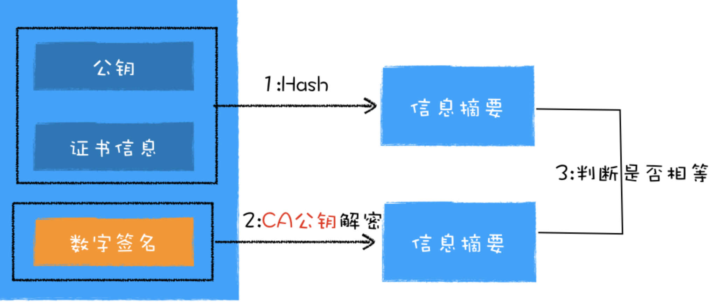
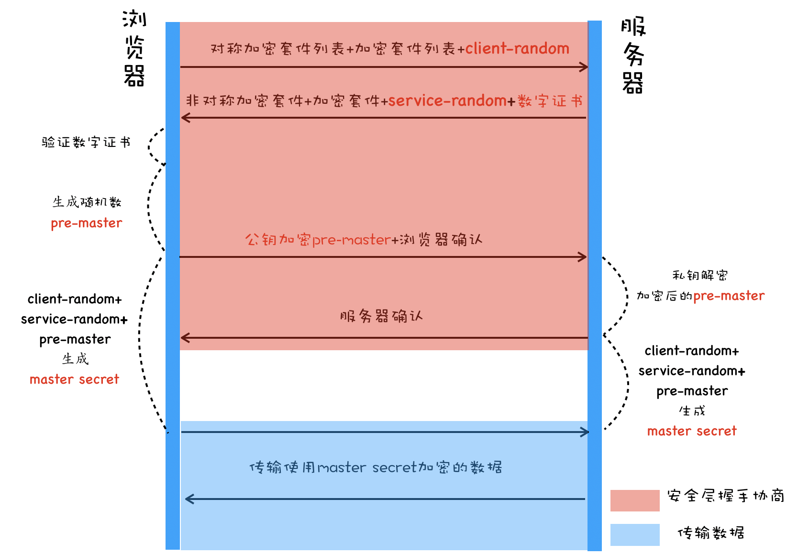

# HTTPS
从 HTTP 协议栈层面来看，HTTP就是在 TCP 和 HTTP 之间插入一个安全层，所有经过安全层的数据都会被加密或者解密。

从图中可以看出，通常 HTTP 直接和 TCP 通信，HTTPS 则先和安全层通信，然后安全层再和 TCP 层通信。也就是说 HTTPS 所有的安全核心都在安全层，它不会影响到上面的 HTTP 协议，也不会影响到下面的 TCP/IP。

安全层(TSL/SSL)有两个主要的职责：对发起 HTTP 请求的数据进行加密操作和对接收到 HTTP 的内容进行解密操作。

## 1. 前置知识：对称加密和非对称加密
### 1）对称加密
加密和解密使用的密钥是相同的。也就是说，加密和解密使用的是同一个密钥。
因此，对称加密算法要保证安全性的话，密钥要做好保密。只能让使用的人知道，不能对外公开。

### 2）非对称加密
加密使用的密钥和解密使用的密钥是不相同的。一把是作为公开的公钥，另一把是作为谁都不能给的私钥。
公钥加密的信息，只有私钥才能解密。私钥加密的信息，只有公钥才能解密。

因为对称加密算法相比非对称加密算法来说，效率要高得多，性能也好，所以交互的场景下多用对称加密。

## 2. 数字证书
对于浏览器来说，数字证书有两个作用：
- 一个是通过数字证书向浏览器证明服务器的身份
- 另一个是数字证书里面包含了服务器公钥

服务器不会直接返回公钥给浏览器，而是返回了数字证书，而公钥正是包含在数字证书中的；
在浏览器端多了一个证书验证的操作，验证了证书之后，才继续后续流程。

### 1）非对称加密，如何将不对称加密的公钥给对方呢？
一种是放在一个公网的地址上，让对方下载；另一种就是在建立连接的时候，传给对方。
但两种方法都有一个问题，就是如何鉴别别人给你的公钥是对的，因为有可能被仿冒。
这时候就需要一个权威，而这个由权威部门颁发的称为证书。

### 2）证书里面有什么呢？当然应该有公钥，这是最重要的；
还有证书的所有者，就像户口本上有你的姓名和身份证号，说明这个户口本是你的；
另外还有证书的发布机构和证书的有效期，这个有点像身份证上的机构是哪个区公安局，有效期到多少年。

### 3）如何生成（申请）证书
生成证书需要发起一个证书请求，然后将这个请求发给一个权威机构去认证，
这个权威机构我们称为 CA（ Certificate Authority）。

假设A公司服务器端需要申请证书：
- 首先A公司需要准备一套私钥和公钥，私钥留着自己使用；
- 然后A公司向 CA 机构提交公钥、公司、站点等信息并等待认证，这个认证过程可能是收费的；
- CA 通过线上、线下等多种渠道来验证A公司所提供信息的真实性，如公司是否存在、企业是否合法、域名是否归属该企业等；
- 如信息审核通过，CA 会向A公司签发认证的数字证书，包含了A公司的公钥、组织信息、CA 的信息、有效时间、证书序列号等，这些信息都是明文的，同时包含一个 CA 生成的数字签名。

最后一步数字签名的过程还需要解释下：首先 CA 使用 Hash 函数来计算A公司提交的明文信息，并得出信息摘要；然后 CA 再使用它的私钥对信息摘要进行加密，加密后的密文就是 CA 颁给A公司的数字签名。这就相当于房管局在房产证上盖的章，这个章是可以去验证的，同样我们也可以通过数字签名来验证是否是该 CA 颁发的。

### 4）浏览器如何验证证书？
浏览器接收到数字证书之后，会对数字证书进行验证。首先浏览器读取证书中相关的明文信息，采用 CA 签名时相同的 Hash 函数来计算并得到信息摘要 A；然后再利用对应 CA 的公钥解密签名数据，得到信息摘要 B；对比信息摘要 A 和信息摘要 B，如果一致，则可以确认证书是合法的，即证明了这个服务器是A公司的；同时浏览器还会验证证书相关的域名信息、有效时间等信息。

### 5）怎么确定CA的公钥是对的？
要想知道某个 CA 的证书是否可靠，要看 CA 的上级证书的公钥，能不能解开这个 CA 的签名。
就像你不相信区公安局，可以打电话问市公安局，让市公安局确认区公安局的合法性。
这样层层上去，直到全球皆知的几个著名大 CA，称为 root CA，做最后的背书。
通过这种层层授信背书的方式，从而保证了非对称加密模式的正常运转。
除此之外，还有一种证书，称为 Self-Signed Certificate，就是自己给自己签名。
这个给人一种“我就是我，你爱信不信”的感觉。

操作系统内置了机构的CA证书：

所以，服务器其实有两个数字证书:
- 服务器向机构申请的数字证书；
- 给服务器签名的 CA 机构的数字证书。通过数字证书链，一直找到 root CA.

那就是浏览器怎么证明根证书 root CA 是合法的？
它只是简单地判断这个根证书在不在操作系统里面，如果在，那么浏览器就认为这个根证书是合法的，如果不在，那么就是非法的。

如果某个机构想要成为根 CA，并让它的根证书内置到操作系统中，那么这个机构首先要通过 WebTrust 国际安全审计认证。

总结一下，通过引入数字证书，我们就实现了服务器的身份认证功能，这样即便黑客伪造了服务器，但是由于证书是没有办法伪造的，所以依然无法欺骗用户。

## 3. HTTPS的工作模式
当你登录一个外卖网站的时候，由于是 HTTPS：
- 1）客户端会发送 Client Hello 消息到服务器，以明文传输 TLS 版本信息、加密套件候选列表、压缩算法候选列表等信息。另外，还会有一个随机数A，在协商对称密钥的时候使用。
- 2）外卖网站返回 Server Hello 消息, 告诉客户端，服务器选择使用的协议版本、加密套件、压缩算法等，
还有一个随机数B，用于后续的密钥协商。
- 3）外卖网站会给你一个服务器端的证书，然后说：“Server Hello Done，我这里就这些信息了。”
- 4）你当然不相信这个证书，于是你从自己信任的 CA 仓库中，拿 CA 的证书里面的公钥去解密外卖网站的证书。
如果能够成功，则说明外卖网站是可信的。这个过程中，你可能会不断往上追溯 CA、CA 的 CA、CA 的 CA 的 CA，
反正直到一个授信的 CA，就可以了。证书验证完毕之后，觉得这个外卖网站可信，于是客户端计算产生随机数字 Pre-master，发送 Client Key Exchange，用证书中的公钥加密，再发送给服务器，服务器可以通过私钥解密出来。
- 5）到目前为止，无论是客户端还是服务器，都有了三个随机数：随机数A、随机数B，以及刚生成的 Pre-Master 随机数。通过这三个随机数，可以在客户端和服务器产生相同的对称密钥。有了对称密钥，客户端就可以说：“Change Cipher Spec，咱们以后都采用协商的通信密钥和加密算法进行加密通信了。”
- 6）然后发送一个 Encrypted Handshake Message，将已经商定好的参数等，采用协商密钥进行加密，
发送给服务器用于数据与握手验证。同样，服务器也可以发送 Change Cipher Spec，说：“没问题，咱们以后都采用协商的通信密钥和加密算法进行加密通信了”，并且也发送 Encrypted Handshake Message 的消息试试。当双方握手结束之后，就可以通过对称密钥进行加密传输了。

这个过程除了加密解密（SSL/TSL, 属于表示层）之外，其他的过程和 HTTP 是一样的，过程也非常复杂。
上面的过程只包含了 HTTPS 的单向认证，也即客户端验证服务端的证书，是大部分的场景。
也可以在更加严格安全要求的情况下，启用双向认证，双方互相验证证书。

总结起来就是： client先和server通过Hello消息进行协商TSL版本、压缩算法、加密套件等信息，均拿到两个随机数；
然后，client从服务器拿到的证书里，获得公钥，生成Pre-master，用公钥加密后发送给server，server通过私钥解密;
这样client和server都拿到了两个随机数，以及Pre-master， 通过这三个参数，就能生成对称密钥，后面就用对称密钥加密进行通信了。

pre-master 是经过公钥加密之后传输的，所以黑客无法获取到 pre-master，这样黑客就无法生成密钥，也就保证了黑客无法破解传输过程中的数据了。

## 4. 重放和防篡改
有了加密和解密，黑客截获了包也打不开了，但是它可以发送 N 次。
这个往往通过 Timestamp 和 Nonce 随机数联合起来，然后做一个不可逆的签名来保证。
Nonce 随机数保证唯一，或者 Timestamp 和 Nonce 合起来保证唯一，
同样的请求只接受一次，于是服务器多次收到相同的 Timestamp 和 Nonce，则视为无效即可。
如果有人想篡改 Timestamp 和 Nonce，还有签名保证不可篡改性，如果改了用签名算法解出来，就对不上了，可以丢弃了。

## 5. 注意事项 
- 各大CA机构的公钥是默认安装在操作系统里的。所以不要安装来路不明的操作系统，否则相当于裸奔；
- 申请数字证书是不需要提供私钥的，要确保私钥永远只能由服务器掌握；
- 数字证书最核心的是 CA 使用它的私钥生成的数字签名；
- 内置 CA 对应的证书称为根证书，根证书是最权威的机构，它们自己为自己签名，我们把这称为自签名证书。