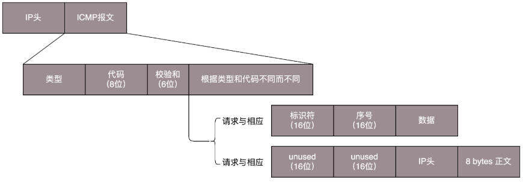

# ICMP
1. ICMP 全称 Internet Control Message Protocol，就是互联网控制报文协议。

网络包在异常复杂的网络环境中传输时，常常会遇到各种各样的问题。
当遇到问题的时候，总不能“死个不明不白”，要传出消息来，报告情况，这样才可以调整传输策略。
这就是ICMP “控制”的意义。可以把ICMP报文看作一个侦察兵。

---

2. ICMP协议是IP层的附属协议，是介于IP层和TCP层之间的协议，一般认为属于IP层协议。 

IP协议用它来与其他主机或路由器交换错误报文和其他的一些网络情况。 
在ICMP包中携带了控制信息和故障恢复信息，主要用于路由器主机向其他路由器或者主机发送出错报文的控制信息。

---

3. ICMP 报文有很多的类型，不同的类型有不同的代码。最常用的类型是主动请求为 8（Echo Request），主动请求的应答为 0 (Echo Reply)。

几个 ICMP 差错报文的例子：终点不可达为 3，源抑制（源站放慢发送速度）为 4，超时为 11，重定向为 5。

---

4. ping的过程

定主机 A 的 IP 地址是 192.168.1.1，主机 B 的 IP 地址是 192.168.1.2，它们都在同一个子网。
在主机 A 上运行“ping 192.168.1.2”

主机A发送处理：
- 1） ping 命令执行的时候，源主机首先会构建一个 ICMP 请求数据包，ICMP 数据包内包含多个字段。
最重要的是两个，第一个是类型字段，对于请求数据包而言该字段为 8；
另外一个是顺序号，主要用于区分连续 ping 的时候发出的多个数据包。每发出一个请求数据包，顺序号会自动加 1。
为了能够计算往返时间 RTT，它会在报文的数据部分插入发送时间。
- 2）IP 层将以 192.168.1.2 作为目的地址，本机 IP 地址作为源地址，加上一些其他控制信息和ICMP数据，构建一个 IP 数据包。
- 3）加入 MAC 头。如果在本机 ARP 映射表中查找出 IP 地址 192.168.1.2 所对应的 MAC 地址，则可以直接使用；
如果没有，则需要发送 ARP 协议查询 MAC 地址，获得 MAC 地址后，由数据链路层构建一个数据帧，
目的地址是 IP 层传过来的 MAC 地址，源地址则是本机的 MAC 地址；还要附加上一些控制信息，依据以太网的介质访问规则，将它们传送出去。

主机B接收处理：
- 1）主机 B 收到这个数据帧后，先检查它的目的 MAC 地址，并和本机的 MAC 地址对比，如符合，则接收，否则就丢弃。
接收后检查该数据帧，将 IP 数据包从帧中提取出来，交给本机的 IP 层。同样，IP 层检查后，将有用的信息提取后交给 ICMP 协议。
- 2）主机 B 会构建一个 ICMP 应答包，应答数据包的类型字段为 0，顺序号为接收到的请求数据包中的顺序号，然后再发送出去给主机 A。

---

5. 经常会遇到一个问题，如果不在我们的控制范围内，很多中间设备都是禁止 ping 的，但是 ping 不通不代表网络不通。
这个时候可以使用 telnet，通过其他协议来测试网络是否通。

---

6. Traceroute 的第一个作用就是故意设置特殊的 TTL，来追踪去往目的地时沿途经过的路由器。
Traceroute 的参数指向某个目的 IP 地址，它会发送一个 UDP 的数据包。

将 TTL 设置成 1，也就是说一旦遇到一个路由器或者一个关卡，就表示它“牺牲”了。
接下来，将 TTL 设置为 2。第一关过了，第二关就“牺牲”了，那我就知道第二关有多远。

怎么知道 UDP 有没有到达目的主机呢？Traceroute 程序会发送一份 UDP 数据报给目的主机，
但它会选择一个不可能的值作为 UDP 端口号（大于 30000）。
当该数据报到达时，将使目的主机的 UDP 模块产生一份“端口不可达”错误 ICMP 报文。如果数据报没有到达，则可能是超时。

---

7. Traceroute还有一个作用是故意设置不分片，从而确定路径的 MTU。

要做的工作首先是发送分组，并设置“不分片”标志。发送的第一个分组的长度正好与出口 MTU 相等。
如果中间遇到窄的关口会被卡住，会发送 ICMP 网络差错包，类型为“需要进行分片但设置了不分片位”。
其实，这是人家故意的好吧，每次收到 ICMP“不能分片”差错时就减小分组的长度，直到到达目标主机。