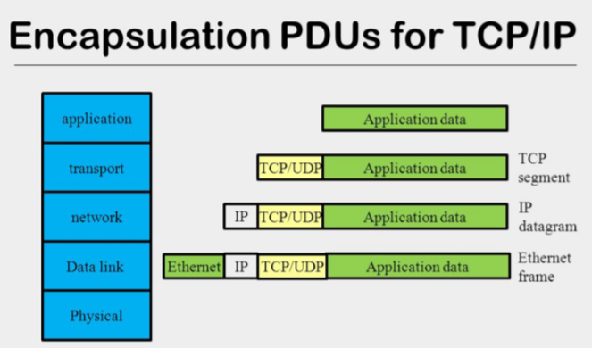
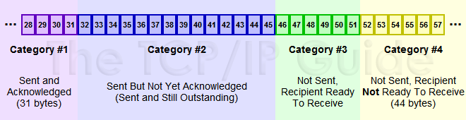
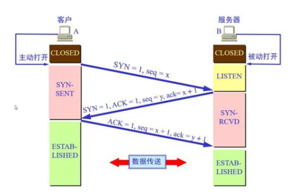
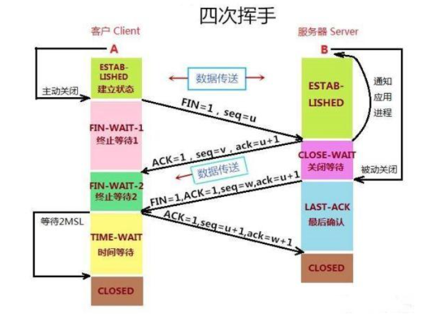

# TCP/IP 核心知识点解析

## 一、TCP 与 IP 协议基础
- **TCP**（传输层）：保证数据可靠性，通过端口号定位进程
- **IP**（网络层）：负责主机寻址和路由
- 通信流程：通过IP地址定位目标主机 → 通过TCP端口找到具体进程



## 二、TCP 滑动窗口 vs 拥塞窗口
### 1. 滑动窗口（流量控制窗口）
- **核心作用**：接收端缓冲区容量指示（接收能力）
- **运作机制**：
  - 接收端通过ACK报文中的window字段动态通告可用缓冲区大小
  - 发送方根据窗口值调整发送速率
  - 采用累计确认机制（必须按序确认）
  


**关键限制**：窗口起始点必须等待连续序列号确认，即使后续包提前到达也会导致：
1. 缓存区暂存无序包
2. 可能触发发送端超时重传（即使包已到达）

### 2. 拥塞窗口（网络传输能力窗口）
- ​**​核心作用​**​：动态感知网络传输能力，防止中间设备（如路由器）过载  
  - 发送方维护拥塞窗口（`cwnd`），窗口大小 = min(接收窗口, 拥塞窗口)
  - 通过​**​丢包事件​**​（超时重传或重复ACK）判断网络拥塞程度

---

#### 四大控制算法深度解析
##### 1. 慢启动（Slow-Start）
- ​**​触发场景​**​：连接建立时、超时重传后
- ​**​核心机制​**​：
  - 初始 `cwnd = 1 MSS`（如1460字节）
  - ​**​指数增长​**​：每收到一个ACK，`cwnd += 1 MSS`  
    （每个RTT窗口大小翻倍，例如：1 → 2 → 4 → 8...）
  - ​**​退出条件​**​：  
    ▪ 当 `cwnd ≥ ssthresh`（慢启动阈值，默认65535字节） → 进入拥塞避免  
    ▪ 检测到丢包 → 触发拥塞控制

##### 2. 拥塞避免（Congestion Avoidance）
- ​**​触发条件​**​：`cwnd ≥ ssthresh`
- ​**​核心机制​**​：
  - ​**​线性增长​**​：每收到一个ACK，`cwnd += 1/cwnd`  
    （每个RTT窗口增加1 MSS，例如：8 → 9 → 10...）
  - ​**​动态调整​**​：  
    ▪ 若发生超时重传 → `ssthresh = cwnd/2`, `cwnd = 1`，重启慢启动  
    ▪ 若收到3个重复ACK → 触发快重传

##### 3. 快重传（Fast Retransmit）
- ​**​触发条件​**​：连续收到3个重复ACK（表明有包丢失但后续包已到达）
- ​**​核心动作​**​：
  - 立即重传丢失的报文段（无需等待超时）
  - 调整窗口：`ssthresh = max(cwnd/2, 2 MSS)`, `cwnd = ssthresh + 3 MSS`  
    （补偿已离开网络的3个重复ACK对应的数据包）

##### 4. 快恢复（Fast Recovery）
- ​**​触发条件​**​：执行快重传后
- ​**​核心机制​**​：
  - ​**​窗口保持​**​：`cwnd = ssthresh`（保留部分窗口容量）
  - 每收到重复ACK → `cwnd += 1 MSS`（补偿新离开网络的数据包）
  - 收到新数据ACK → 退出快恢复，进入拥塞避免阶段

---

#### 关键参数与状态转换
| 事件类型         | 处理动作                                  | 窗口变化示例         |
|------------------|------------------------------------------|----------------------|
| 连接建立         | 进入慢启动                               | cwnd=1, ssthresh=64 |
| 收到新ACK        | cwnd按当前阶段增长                       | 慢启动：2→4→8...    |
| 超时重传         | 重置慢启动，窗口归零                     | cwnd=1, ssthresh=32 |
| 收到3个重复ACK   | 触发快重传和快恢复                       | cwnd=32+3=35        |
| 快恢复期间新ACK  | 退出快恢复，进入拥塞避免                 | cwnd=32 → 线性增长  |

---

#### 可视化拥塞控制过程
```text
慢启动阶段（指数增长）
cwnd: 1 → 2 → 4 → 8 → 16 → 32 (达到ssthresh=32)
↓
拥塞避免阶段（线性增长）
cwnd: 32 → 33 → 34 → 35...
↓
收到3个重复ACK → 快重传
ssthresh = 35/2=17, cwnd=17+3=20
↓
快恢复阶段 → 收到新ACK后进入拥塞避免
cwnd=17 → 18 → 19...
```


## 三、分片丢包处理
| 协议 | 处理机制 | 特点 |
|------|---------|------|
| UDP  | CRC校验失败直接丢弃 | 无重传机制 |
| TCP  | 超时重传 + 快速重传 | 超时时间指数退避 |

**TCP超时策略**：每次超时后重传间隔翻倍（避免网络拥塞恶化）

## 四、多连接端口复用
- **TCP连接**：
  ```text
  A → C:100
  B → C:200 是两个独立连接
  
  C端使用不同socket处理（各自独立缓冲区）
  recv(300) 实际接收各自socket的数据
  ```
- **UDP连接**：无连接状态，按报文逐个处理

## 五、粘包与半包问题
一个发送可能被多次接收，多个发送可能被一次接收，TCP又是流式协议，所以可能会导致粘包和半包。
### 1. 粘包
- **成因**：
  - 发送缓冲区累积多个小包
  - 接收读取不及时
- **解决方案**：
  - 设置TCP_NODELAY（启用PUSH标志）
  - 加自定义包头、包尾的检查位，程序进行控制

比如一次发了AAA、BBB两个独立的包，但是AAA+BBB才达到缓冲区大小，这时候才会发送；接收端可能收到 AAABBB 或者BBBAAA（网络问题，可能后发的包先到了）粘在一起的包。

### 2. 半包
- **成因**：
  - 数据 > 缓冲区/MSS
  - 需要分片传输
- **典型案例**：
  ```python
  # 发送 10KB 数据（MSS=1460）
  → 分7个包发送（1460*6+880）
  ```
拆包可能就会导致粘包问题。

## 六、三次握手原理

- **关键作用**：防止已失效的连接请求报文段突然又传送到了服务端，因而产生错误
- **典型异常**：客户端发出连接请求，但因连接请求报文丢失而未收到确认，于是客户端再重传一次连接请求。后来收到了确认，建立了连接。数据传输完毕后，就释放了连接，客户端共发出了两个连接请求报文段，其中第一个丢失，第二个到达了服务端，但是第一个丢失的报文段只是在某些网络结点长时间滞留了，延误到连接释放以后的某个时间才到达服务端，此时服务端误认为客户端又发出一次新的连接请求，于是就向客户端发出确认报文段，同意建立连接。不采用三次握手，只要服务端发出确认，就建立新的连接了，此时客户端忽略服务端发来的确认，也不发送数据，则服务端一致等待客户端发送数据，浪费资源。


## 七、四次挥手原理
TCP是全双工的，两边都要关闭了才算关闭，而且一方的关闭也要确认对方确认。


- **阶段说明**：
  1. client先发送FIN告知是server我已经完成数据发送了，server回复ack来确定我知道了。这样一个流程，就关闭了client的发送信息通道。但是还可以接收来自server方的数据。
  2. server此时已经知道接收不到client的数据了，但是还可以给它发送数据。如果server也没有数据要发送给对方了，server也会以FIN标志位发送一个信息给client，client接到后，也会传递一个ack表示知道了。这样子，双方都完成了关闭。

- **TIME_WAIT必要性**：
  - 保证最后ACK可靠传输（2MSL等待）
  - 防止旧连接报文干扰新连接

MSL指的是Maximum Segment Lifetime：一段TCP报文在传输过程中的最大生命周期，超过这个时间，包则被丢弃。

当客户端发出最后的ACK确认报文时，并不能确定服务器端能够收到该段报文。等待2MSL就是为了确保服务器能收到该报文，如果服务器未收到，可以请求客户端重发，这样客户端还有时间再发，重启2MSL计时。否则服务器端这个端口可能一直占着得不到关闭。

还有一个异常情况就是，服务器超过了 2MSL 的时间，依然没有收到客户端发送的ACK，怎么办呢？按照 TCP 的原理，服务器端当然还会重发 FIN，这个时候客户端 再收到这个包之后，就表示，我已经在这里等了这么长时间了，已经仁至义尽了，之后的我就都不认了，于是就直接发送RST，服务器就知道客户端早就跑了。


## 八、MAC地址存在意义
| 维度 | MAC地址 | IP地址 |
|------|---------|--------|
| 定位 | 局域网内设备标识 | 网络层定位 |
| 特性 | 硬件唯一标识 | 逻辑可变地址 |
| 路由 | 二层转发依据 | 三层路由依据 |

- 在一个局域网内，MAC 地址是不能重复的。 MAC 地址更像是身份证，是一个唯一的标识。
它的唯一性设计是为了组网的时候，不同的网卡放在一个网络里面的时候，可以不用担心冲突。
从硬件角度，保证不同的网卡有不同的标识。而现在常用的动态分配IP（DHCP）地址是会变化的，
你怎么知道你还是你，就是需要 MAC 这个唯一标识了。
- 一个网络包要从一个地方传到另一个地方，除了要有身份证以外，还需要有定位功能，即知道对方在哪里。 
而有“在哪里”属性的 IP 地址，才是有远程定位功能的。
如果我们只用 MAC 地址的话，我们会发现路由器需要记住每个 MAC 地址所在的子网是哪一个（不然每一次收到数据包的时候路由器都要重新满世界地去找这个 MAC 地址的位置）。
而世界上有2^48个 MAC 地址，这就意味着即使我们给每个 MAC 地址只留 1 字节的储存空间，每个路由器也需要 256 TB 的内存！这显然是不可能实现的。


## 九、CIDR与子网划分
- **CIDR表示**：`10.100.122.2/24`
  - 网络号：前24位（10.100.122.0）
  - 主机号：后8位（0-255）
- **优势**：灵活分配地址空间，减少路由表条目

## 十、网关类型解析
| 网关类型 | 功能特点 | 典型场景 |
|---------|----------|----------|
| 转发网关 | IP不变跨网段转发 | 同协议网络互联 |
| NAT网关 | IP地址转换 | 解决地址冲突/私网访问公网 |

**NAT表示例**：
```
国际IP: 192.168.56.2 → 国内IP: 192.168.1.101
```

## 十一、TCP丢包处理机制
### 双重保障机制
1. **超时重传**（保守策略）
   - RTO（Retransmission Timeout）指数退避
2. **快速重传**（主动检测）
   - 收到3个重复ACK立即重传

### 确认机制对比
| 机制类型 | 确认方式 | 效率 |
|---------|---------|------|
| 累计确认 | 确认最大连续序号 | 高 |
| 选择确认 | 指定接收区间（SACK） | 更高（需双方支持） |

为了保证不丢包，对于发送的包都要进行应答，但是这个应答也不是一个一个来的，而是会应答某个之前的 ID，表示都收到了，这种模式称为累计确认或者累计应答（cumulative acknowledgment）。比如6，7，8，9都收到了，回一个9的ACK，就知道前面的包都收到了。

TCP的策略是超时间隔加倍：每当遇到一次超时重传的时候，都会将下一次超时时间间隔设为先前值的两倍。两次超时，就说明网络环境差，不宜频繁反复发送。

还有一个快速重传的机制：当接收方收到一个序号大于下一个所期望的报文段时，就检测到了数据流中的一个间格，于是发送三个冗余的 ACK，客户端收到后，就在定时器过期之前，重传丢失的报文段。

例如，接收方发现 6、8、9 都已经接收了，就是 7 没来，那肯定是丢了，于是发送三个 6 的 ACK，要求下一个是 7。客户端收到 3 个，就会发现 7 的确又丢了，不等超时，马上重发。


## 十二、网络协议分层原则
**核心定律**：网络包必须完整包含下层协议头
- 有效包结构：`[MAC头][IP头][TCP头][数据]`
- 非法包示例：`[IP头][数据]`（缺少MAC头，无法传输）

只要是在网络上跑的包，都是完整的。可以有下层没上层，绝对不可能有上层没下层。
所以，对 TCP 协议来说，三次握手也好，重试也好，只要想发出去包，就要有 IP 层和 MAC 层，不然是发不出去的。

## 十三、网络设备层级
| 设备层级 | 处理深度 | 典型设备 |
|---------|---------|----------|
| 二层设备 | 解析MAC头 | 交换机 |
| 三层设备 | 解析到IP头 | 路由器 |

**处理流程对比**：
```text
交换机：拆MAC头 → MAC地址表查询 → 转发/丢弃
路由器：拆MAC头 → 拆IP头 → 路由表查询 → 封装新MAC头
```